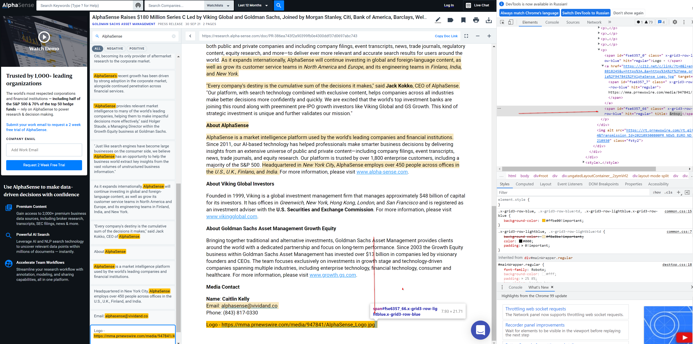

### How to run

To run tests use the '`gradlew clean test`' command.

To run tests with a specific base url use the '`gradlew clean test -DsiteUrl=<your_url>`' command.

To generate Allure test report use the '`gradlew allureServe`' command.
### Information about tests

The api test 'checkTopicsAreNotEmptyForKeywordSearch' fails because I was asked to fail one api test.

The ui test 'checkHighlightedArticleTextAfterSearchingForAdditionalKeywords' fails because your app works incorrectly. For some reasons it highlights the last HTML element with whitespace and non-breaking space:
` &nbsp;`

